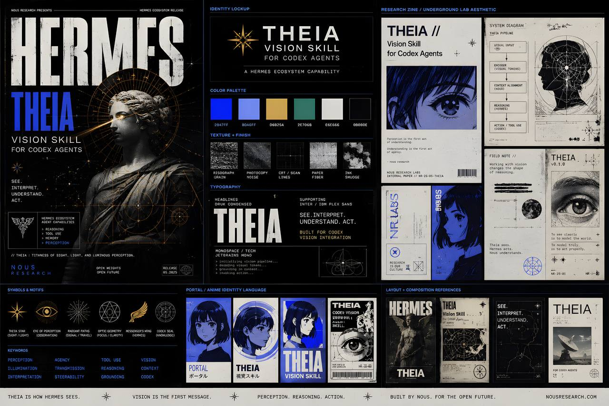

# Hermes: Theia — Codex Vision Skill

A Hermes Agent skill for image analysis and generation via the OpenAI Codex CLI.

## What It Does

- **Image analysis** — Describe, QA, and understand images via Codex's vision capabilities
- **Image generation** — Generate new images using Codex's built-in `image_gen` tool (GPT-image-2)
- **Identity-preserve generation** — Use reference images to maintain consistent identity across generated portraits
- **Batch generation** — Generate multiple images from a shared reference with a prompt file

## Requirements

| Requirement | Details |
|---|---|
| **Codex CLI** | `npm install -g @openai/codex` |
| **ChatGPT Plus** | Required for image generation (OAuth, not API key) |
| **Auth** | `codex auth login` completed — valid `~/.codex/auth.json` |

Codex uses **ChatGPT Plus OAuth tokens**, not an API key. `~/.codex/auth.json` has `"auth_mode": "chatgpt"` and `"OPENAI_API_KEY": null`. If tokens are invalidated, re-auth via `codex auth login`.

OpenRouter does **not** support image generation (404 on `/v1/images/generations`).

## Quick Start

### Analyze an Image

```bash
cd /path/to/images && codex exec \
  "Describe this image in detail" \
  --image photo.jpg \
  --skip-git-repo-check
```

### Generate an Image (No Reference)

```bash
cd /path/to/output
codex exec --skip-git-repo-check -s workspace-write --add-dir /path/to/output \
  "Generate a photorealistic portrait. Save to /path/to/output/result.jpg"
```

### Generate with Reference (Identity-Preserve)

```bash
codex exec --skip-git-repo-check -s workspace-write \
  --add-dir /path/to/references \
  -i primary-reference.jpg \
  --add-dir /path/to/output \
  "Generate a portrait. Reference identity from attached image. Save to /path/to/output/result.jpg"
```

### Use the Helper Scripts

```bash
# Single image with reference
./scripts/generate_with_reference.sh ~/refs/primary.jpg ~/output/portrait.jpg "Generate a portrait: [description]"

# Analyze an image
./scripts/analyze_image.sh /path/to/photo.jpg

# Batch generation from prompt file
./scripts/batch_generate.sh ~/refs/primary.jpg ~/output prompts.txt
```

## Skill Structure

```
SKILL.md                              # Main skill documentation
scripts/
  generate_with_reference.sh          # Single image generation with reference
  analyze_image.sh                    # Image analysis via Codex vision
  batch_generate.sh                   # Batch generation from prompt file
references/
  identity-constants-template.md      # Template for documenting entity identities
```

## Key Concepts

### Writable Sandbox

Codex runs read-only by default. For image generation, you **must** use `-s workspace-write` and `--add-dir` for every directory Codex needs to access:

```bash
codex exec --skip-git-repo-check -s workspace-write --add-dir /target/dir "... Save to /target/dir/output.jpg"
```

### Non-TTY Prompt Handling (Hermes Terminal)

In Hermes terminal sessions (non-TTY), pipe prompts via `printf` for reliable delivery:

```bash
printf '%s' "Generate a portrait. Save to /target/output.jpg" | \
  codex exec --skip-git-repo-check -s workspace-write --add-dir /target/dir -
```

### Output Path Resolution

Codex writes to `$CODEX_HOME/generated_images/<session_id>/ig_XXXX.png` first. Copy/convert to your final destination afterward:

```bash
SESSION=$(ls -lt ~/.codex/generated_images/ | head -1 | awk '{print $NF}')
sips -s format jpeg ~/.codex/generated_images/$SESSION/ig_*.png --out /target/output.jpg
```

### Prompt Verbosity

| Style | Speed | Quality | Use When |
|---|---|---|---|
| Brief (single-line) | ~60s | Good | Iteration, exploration |
| Verbose (structured) | 2–3 min | Best | Final canonical assets |

### iCloud Placeholder Pitfall

Files synced to iCloud may be "dataless" placeholders — correct file size but no readable pixel data. Always verify with `file <path>` and use local copies for reference images.

## Troubleshooting

| Error | Cause | Fix |
|---|---|---|
| `401 Unauthorized` | Expired OAuth token | `codex auth login` |
| `Resource deadlock avoided` | iCloud placeholder | Use local copy |
| `unable to open database file` | `keep` reflection failed | Non-fatal, ignore |
| `No generated image found` | Sandbox not writable | Add `-s workspace-write --add-dir /target` |
| Timeout (300s) | Prompt too verbose | Use brief prompt |
| `No prompt provided via stdin` | Non-TTY issue | Pipe via `printf '...' \| codex exec -` |

## License

MIT
